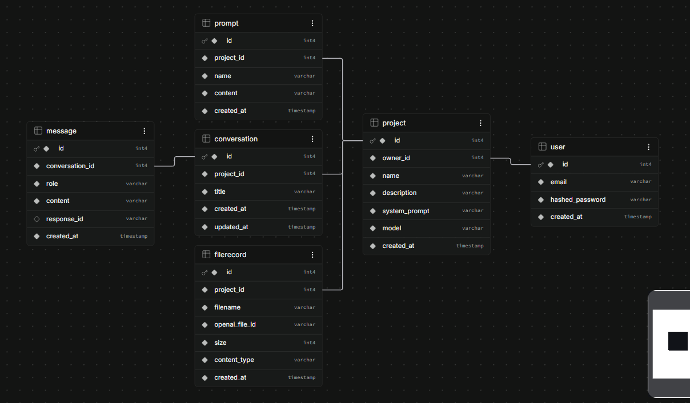

# ChatME

A full-stack multi-agent chatbot platform allowing users to configure distinct AI agents, manage prompt templates, upload files, and maintain multi-thread chat histories across OpenAI-compatible LLM providers.

## Live Demo

**Live demo:** [https://chat-me-teal-rho.vercel.app/](https://chat-me-teal-rho.vercel.app/)

---

## How to Run

> You can try the application instantly without local setup via the [Live Demo](https://chat-me-teal-rho.vercel.app/).

### 1. Backend Setup

```bash
cd backend

# Create & activate virtual environment
python -m venv .venv
.venv\Scripts\activate        # On Windows
# source .venv/bin/activate   # On macOS/Linux

# Install dependencies
pip install -r requirements.txt

# Create environment file
copy .env.example .env        # On Windows
# cp .env.example .env        # On macOS/Linux
```

Configure your local `backend/.env` with variable names (no secrets needed for basic startup):
```env
JWT_SECRET=your_jwt_secret
ACCESS_TOKEN_TTL_MIN=1440
LLM_BASE_URL=https://api.groq.com/openai/v1
LLM_API_KEY=your_llm_api_key
LLM_MODEL=llama-3.1-8b-instant
SUPABASE_URL=your_supabase_project_url
SUPABASE_SERVICE_KEY=your_supabase_service_key
CORS_ORIGINS=http://localhost:5173
```

Start the FastAPI server:
```bash
uvicorn app.main:app --reload --port 8000
```
*API documentation is available locally at [http://localhost:8000/docs](http://localhost:8000/docs).*

### 2. Frontend Setup

```bash
cd frontend

# Install dependencies
npm install

# Start Vite development server
npm run dev
```
*Access the frontend UI at [http://localhost:5173](http://localhost:5173).*

---

## Features → Requirements

| Requirement | Implementation Status & Details |
|---|---|
| **Login (email + password)** | Implemented via OAuth2 password flow with bcrypt password hashing and stateless PyJWT authentication (`app/routers/auth.py`, `app/security.py`). |
| **Create a project/agent under a user** | Implemented (`app/routers/projects.py`). Users can create, update, list, and delete isolated agent projects with system prompts and custom models. |
| **Store prompts tied to a project/agent** | Implemented (`app/routers/prompts.py`). Reusable prompt templates are created per project and dynamically selected during chat turns as system context. |
| **Chat interface using an LLM API** | Implemented (`app/routers/chat.py`, `app/llm.py`). Supports both OpenAI Responses API (`/v1/responses`) and OpenAI-compatible `/chat/completions` (e.g. Groq, OpenRouter). |
| **Upload files into a project** | Implemented (`app/routers/files.py`). Uploads are proxied directly to cloud storage (Supabase Storage) with database record tracking and size validation. |

### Additional Features Implemented Beyond Requirements
- **Multi-Conversation Threading**: Projects host multiple isolated conversation threads with auto-generated titles and thread switching.
- **Strict Ownership Security**: Centralized FastAPI dependencies (`get_owned_project`, `get_owned_conversation`) guarantee strict per-user data isolation and prevent cross-tenant resource leakage (404 on access violations).
- **Dual LLM Provider Protocol**: Clean abstract provider (`LLMProvider`) supporting stateful `previous_response_id` chaining (OpenAI) and context replay (Groq / OpenRouter).
- **Cloud Object Storage Integration**: Direct streaming file uploads and downloads powered by Supabase Storage.

---

## Architecture



---

## Tech Stack

| Layer | Technology Used |
|---|---|
| **Frontend Framework** | React 18 + Vite |
| **Frontend Routing & Styling** | React Router v6 + Custom Vanilla CSS |
| **Backend Framework** | FastAPI (Python 3.12) |
| **Database & ORM** | Supabase (PostgreSQL) / SQLite + SQLModel (SQLAlchemy + Pydantic) |
| **Authentication** | PyJWT + bcrypt |
| **LLM Provider** | Groq (`llama-3.1-8b-instant`) / OpenAI (`/v1/responses`) |
| **File Storage** | Supabase Storage |
| **HTTP Client** | `httpx` (async) |
| **Hosting & Deployment** | Vercel (Frontend) + Render Docker (Backend) |
